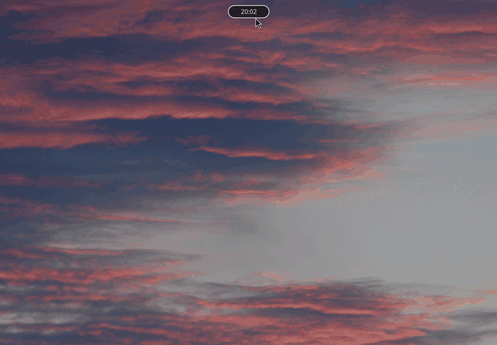

# Dynamic Island for Hyprland

An Apple-style Dynamic Island for Hyprland, written in QML for [Quickshell](https://quickshell.org).

A small clock pill sits at the top of the screen and expands into a weather widget, an
application launcher, a wallpaper switcher, a power menu, or a notification popup —
depending on what you ask it for. Black and white only; the wallpaper shows through and
sets the mood.



## Features

- **Clock pill** — the resting state. Just the time.
- **Weather** — hover the pill and it expands to the date plus temperature, rain,
  wind and cloud cover. Data from [Open-Meteo](https://open-meteo.com) (DWD ICON), refreshed every minute.
- **Launcher** — app search over your `.desktop` entries, matched from the start of the
  name. Type to filter, then Enter to launch the top hit or click any entry.
- **Wallpaper switcher** — a horizontal strip of previews from your wallpaper folder.
  Type to filter by filename, then click a tile or press Enter for the first one.
- **Power menu** — lock, shut down, reboot. `h` / `l` to move, Enter to confirm.
- **Notifications** — incoming desktop notifications appear inside the island and
  disappear again after five seconds.

### Launcher prefixes

Beyond searching applications, the input field understands a few prefixes:

| Prefix  | What it does                                                        |
|---------|---------------------------------------------------------------------|
| `g `    | Google search — or opens the URL directly if it looks like one       |
| `yt `   | YouTube search                                                       |
| `a `    | Amazon search                                                        |
| `fpv `  | Searches nine FPV shops at once, one browser tab each                |
| `mp3 `  | Downloads a link as audio via `yt-dlp`                               |
| `mp4 `  | Downloads a link as video via `yt-dlp`                               |
| `s `    | Runs a script from your script folder                                |
| `i `    | Searches Arch/AUR packages (`yays`, included in `scripts/`)          |
| `ii `   | Installs a package with `yay -S --noconfirm`                         |

## Requirements

- [Hyprland](https://hyprland.org) and [Quickshell](https://quickshell.org)
- `kitty` — terminal used for downloads and package search
- `firefox` — or set `browser` in the config (see below)
- `yt-dlp` — for `mp3 ` / `mp4 `
- `awww` — wallpaper daemon used by the wallpaper switcher
- `hyprlock` — for the power menu's lock action
- `curl`, `bash`, `nmcli` — weather and the bar's status pills

Anything missing simply does nothing when you trigger it — there is no error popup, so
check this list first if a feature seems dead.

## Installation

```bash
git clone https://github.com/julianposch1307/dynamic-island
cd dynamic-island
cp -r shell.qml bar ~/.config/quickshell/
mkdir -p ~/scripts && cp scripts/yays ~/scripts/
```

Then bind the shortcuts in your `hyprland.conf`:

```
bind = SUPER, SPACE, global, quickshell:launcher
bind = SUPER, M,     global, quickshell:powermenu
bind = SUPER, W,     global, quickshell:wallpaperswitcher
```

Start it with `quickshell`, or autostart it with `exec-once = quickshell`.

If you'd rather open the launcher with a bare `SUPER`, it takes two changes: bind it on
release, since a modifier key can only be acted on once it is let go —

```
bindr = SUPER, SUPER_L, global, quickshell:launcher
```

— and change `onPressed` to `onReleased` on the launcher shortcut in `shell.qml`.
Hyprland delivers only the event matching the bind type, so the two have to agree.

## Configuration

Everything configurable lives in the `DynamicIsland { }` block at the bottom of
`shell.qml`. It works as it is — the only thing you may want to add is a pair of
coordinates, if you'd like the weather widget to show something.

```qml
DynamicIsland {
    id: dynamicIsland

    // Coordinates of wherever you'd like the forecast for (e.g. from openstreetmap.org)
    weatherLat: NaN
    weatherLon: NaN

    // Optional, defaults shown
    browser:      "firefox"
    wallpaperDir: "/home/you/Pictures/Wallpapers"
    downloadDir:  "/home/you/Downloads"
    scriptDir:    "/home/you/scripts"
}
```

Leave the coordinates alone and the weather fields simply show `---`; no request is made
to Open-Meteo at all. Everything else works regardless.

Paths must be absolute — `~` is not expanded. The defaults are derived from `$HOME`, so
they are usually correct without touching them.

Note that `browser` is also handed to `yt-dlp --cookies-from-browser`, which expects a
name from its own list (`firefox`, `chrome`, `chromium`, `brave`, …). If your browser's
executable name differs from that, the downloads will fail while everything else works.

## Notes

- **The island reserves 35 px at the top of your primary screen.** Windows are laid out
  below it. If you already run a bar, it will sit underneath.
- **The included bar is a minimal example**, there so those 35 px aren't empty. If you
  have your own bar, you only need `bar/DynamicIsland.qml` and the matching parts of
  `shell.qml`.
- **No battery widget.** This grew on a desktop. PRs welcome.
- CPU temperature is read from `coretemp` / `k10temp` via `hwmon`, which covers Intel and
  AMD. Other sensors are not detected.
- Interactive states only appear on your primary screen; other monitors get the clock pill.

## License

MIT
